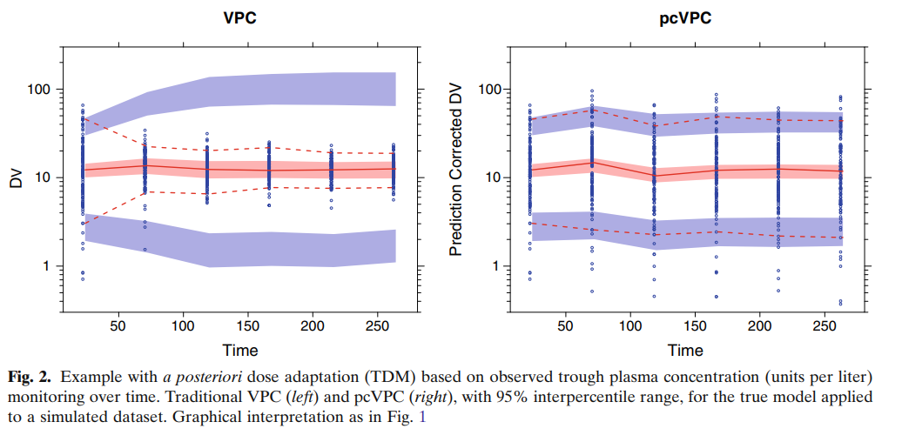

---


---
```{r setup, include=FALSE}
color <- function(x, color) {
  if (knitr::is_latex_output()) {
    sprintf("\\textcolor{%s}{%s}", color, x)
  } else if (knitr::is_html_output()) {
    sprintf("<span style='color: %s;'>%s</span>", color,
      x)
  } else x
}
```

# Model evaluation makes it easy

## Residuals-based method

 (ref: Developing tools to evaluate non-linear mixed effect models: 20 years on the npde adventure)
 
### Prediction error (difference between the true value and the prediction, bias)
-	RMSE? (the magnitude of PE, imprecision)

Shortcomings:
	  - Prediction error of population predictions or individual predictions?
      Population residuals
      Individual residuals, more focused on evaluation of the residual error model
    - Potential heteroscedasticity in the residual error model (magnitude of residuals varies across the range of observations)
    
Solution: 
  -	weighted residuals (WRES), weighting the residuals using the expected variance of the prediction

### WRES
  
$$
   WRES=\frac{\vec{y_{i}}-E_{FO}(\vec{y_{i}})}{ \sqrt{Cov_{FO}(\vec{y_{i})}}}
$$
The $WRES$ should be $N(0,1)$ as long as the model adequately describes the data and the model linearlization using FO is adequate to describe the model.

Shortcomings: the performance of WRES for model evaluation in NLME has been consistently shown to be poor:
- bias introduced by the first-order approximation, because WRES are calculated using the FO approximation. This is the case even if the model development process has taken place using the FOCE methods.
- the true distribution is unknown.

Solution: CWRES

### CWRES

A model diagnostics for the FOCE method

$$
   CWRES=\frac{\vec{y_{i}}-E_{FOCE}(\vec{y_{i}})}{ \sqrt{Cov_{FOCE}(\vec{y_{i})}}}
$$

The $CWRES$ are computed in the same manner as the $WRES$ but using the FOCE approximation to the model.

## Simulation-based method

*Common problems:*
- *The choice of bins*. Within a bin there should always be an even distribution of the observation. If one bin has a series of observations that are outliers, then the observations will lie in either of the two ends of the prediction interval, making the plot a bit problematic.
- *The dose adjustment*. the random variability is always randomly sampled. While in the real clinical setting the next dose is aimed for
- *The different covariate*

### VPC

A a `r color("within-bin comparison", "red")` of the empirical distribution of the observations with the corresponding model-based predictions. Percentiles of the simulated data are compared to the corresponding percentiles of the observed data. The percentiles are calculated either for each unique value of the independent (x-axis) variable or for a bin across the independent variable. By calculating the percentiles of interest for each of the simulated replicates of the original dataset design, a `r color("nonparametric confidence interval", "red")` can be generated for the predicted percentiles. 

There are three basic types of VPC.
- scatter VPC
This shows the observations along with simple prediction intervals

- percentile VPC
This summarizes the distribution of observations with observation intervals so they can directly compare the prediction intervals and the observed intervals.

- confidence interval VPC
This type shows the 95% CI interval around each of the prediction intervals obtained by simulation.

Problems: if the VPC is performed in dataset with varied doses and varied time, the bin selected and the prediction interval will not be representative for the dataset included in the bin. Whenever the predictions within a bin differ largely due to different values of other independent variables (e.g, dose, covariates), the diagnosis may be hampered or misleading. In such cases, only a part of the variability observed in the a traditional VPC will be caused by the random effect. Apart from making it difficult to use these VPCs to diagnose the random effects, this can also lower the power of detecting a model misspecification in the structural model.

### pcVPC

A prediction corrected VPC that normalized the observation and prediction with the population prediction values. How to draw it?

- First to calculate the median of the predictions per bin ($PRED_{bin}$).
- Then for the simulation dataset calculation the PRED relative to the $PRED_{bin}$. Then for each PRED we need to multiply the fold difference.
- Then for the observation dataset calculate the PRED relative to the $PRED_{bin}$, and for each DV we need to multiply the fold difference.
- The transformed simulations and observations are percentiles as the normal VPC

```{r vpc,echo=FALSE, eval=TRUE}

```

Figure 2 illustrates the conceptual benefit of pcVPC in application to data following dose adaptations correlated to the dependent variable. The observed data in the VPC show decreasing concentration variability with time due to dose adaptations. In contrast, the model-predicted interpercentile range increased since simulations based on the realized design do not maintain any correlation between dose alterations and the previous observed concentration. The pcVPC corrects for the dose adjustments and correctly indicates no discrepancy between the observations and the model prediction.

### NPC Numerical predictive check
The vpc (Visual Predictive Check) tool and the npc (Numerical Predictive Check) are two closely related model diagnostics tools.It evaluates whether Observed percentiles are within the confidence interval of the corresponding predicted percentiles.  A coverage plot for the NPC looks at different prediction intervals (PIs) for each data point and calculates the total number of data points in the data set lying outside of these PIs. The plot shows the relative amount of data points outside of their PI compared to the expected amount at that PI.  In addition a confidence interval around these values are computed based on the simulated data.
How to draw a NPC plot?

- The solid line is the The ratio between the observed and expected percentages of data above the upper and below the lower limits of the 0%, 20%, 40%, 60%, 80%, 90%. In which the expected percentages are calculated as (100-PI)/2. The observed data are calculated as:

  1. identify prediction intervals: 0, 20, 40, 50, 60, 80, 90, 95% for each observation from n number of simulations
  2. calculate how many percentage of observations are above or below their own PIs.
  
- The CI (shade) is calculated by for each simulated points repeating the procedure as the observed data

Just as in a VPC plot, a trend in the NPC coverage plot would indicate a misspecification of the structural, interindividual variability, or residual error model (Supplementary Figure S9). 

As NPC evaluates model misspecification on several PIs, it may provide additional information compared to the VPC, which only presents one selected PI. In addition, it compares each observation with its own simulated distribution, so normalization and stratification to handle the binning, as in the VPC, is not necessary. However, unlike VPC, which is a representation of observations and predictions vs. time, NPC loses the time dimension; therefore, it would not be able to point out at which time points the model overpredicted or underpredicted the data.